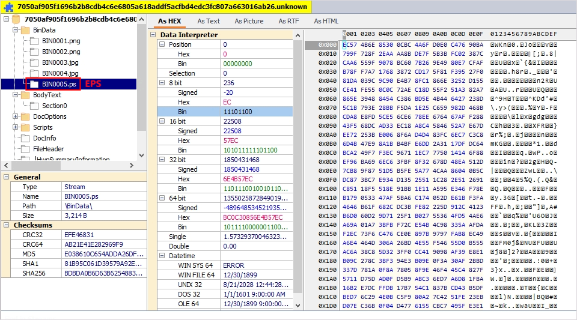
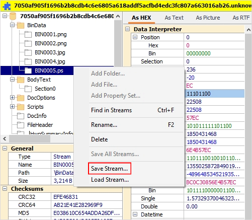
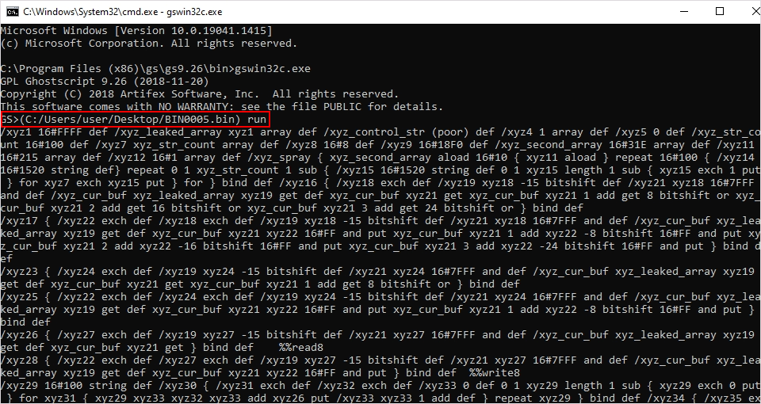

## hwp

### hwp format

[hwp Format Info](https://www.hancom.com/etc/hwpDownload.do)

'한글 2002'부터 '한글 2018'까지 현재 출시된 한글 프로그램은 기본적으로 5.0버전의 한글 문서 파일 형식으로 한글 파일(.hwp)를 생성.

파일 크기를 최소화하기 위하여 압축 기능을 사용하는데 그림 관련 데이터를 포함한 일부 스트림은 파일의 크기를 줄이기 위해 `zlib`으로 압축해서 저장하는 방식을 사용.

주목해야될 스토리지로 바이너리 데이터를 의미하는 `BinData`라는 스토리지가 존재하는데 여기에 그림 또는 `OLE Object`가 스트림으로 `zlib`으로 압축되어 저장되어 짐.

한글 문서에 그림 파일을 삽입할 수 있는데 삽입 가능한 파일 포맷중에 EPS 파일이 포함되어 있음.

그리고 한글 파일에 포함된 EPS 파일은 `BinData` 스토리지에 각각의 스트림으로 `zlib`으로 압축되어 저장하게 됨.


## Attack

### EPS attack

한글 프로그램에서 지원하는 `EPS(Encapsulated PostScript)`파일을 이용한 공격방식이 대부분.

EPS(Encapsulated PostScript) 파일은 포스트스크립트(PostScript) 프로그래밍 언어로 작성된 규격화된 파일로서, 하나의 그래픽을 표현.

여기서 포스트스크립트란 Adobe에서 만든 스크립트 형식의 PDL(Page description language, 페이지 기술 언어)언어이며, 프린터 같은 출력 가능한 디바이스를 대상으로 폰트 표현 등 다양한 내부 프로세싱을 지원한다. 

한글 프로그램 또한 EPS 그래픽 파일을 사용자 화면에 보이게 하기 위해 포스트스크립트 인터프리터를 내 장하고 있다.

한글 프로그램에 내장된 인터프리터는 고스트스크립트(Ghostscript)이며, GNU Affero GPL 라 이선스 아래 코드가 공개되어 있다.

한글 문서에서 EPS 이미지가 포함된 페이지가 로드될 때 이를 화면에 표현하기 위해 gbb.exe 파일과 gswin32c.exe 파일이 순차적으로 실행된다

한글 프로그램은 문서를 읽는 과정에서 EPS 그림 파일이 있을 경우, 해당 파일에 대해서만 화면 표시를 고 스트스크립트 인터프리터로 넘긴다.

한글은 고스트스크립트를 단순 호출하고 작업 이후 종료 여부에 관해 서만 확인하며, 고스트스크립트 내부에 일어나는 일에 대해서는 관여하지 않는다.

고스트스크립트도 EPS 파 일의 포스트스크립트 코드를 처리한 뒤 최종 표현하는 출력 디바이스가 한글 문서 화면이며, 단독으로 EPS 파일 실행이 가능하다.


## EPS attack

### 1. SSView를 사용하여 hwp 파일을 추출

BIN0005.ps로 보이는 EPS를 추출.
해당 데이터는 zlib으로 압축되어 있으므로 압축 해제를 해줄 필요가 있음.





### 2. 파이썬을 사용하여 zlib 압축 해제

``` python
import zlib

flist = ["BIN0005.ps.stream"]

for file in flist:
    with open(file, "rb") as f:
        buf = f.read()
        unzlibed = zlib.decompress(buf, -9)
        with open(item+".unzlib", "wb") as f:
            f.write(unzlibed)
```

위 코드를 사용하여 파일을 압축 해제를 수행하면 아래와 같은 코드를 확인할 수 있음.
해당 코드는 image 변수에 저장된 PostScript 바이트열을 실행하는 코드.


```PostScript
/image <(bytes)> def
image cvx exec
```

### 3. exec를 print로 변경하 ghost script를 사용해 image에 숨겨진 명령어를 추출




### 4. 추출 결과를 복사하여 확인

추출 결과 내부에는 긴 바이트열이 존재하는 것을 확인 가능


해당 바이트열을 사용하여 파일을 생성하고 내부를 확인


특정 파일을 svchost.exe라는 이름으로 다운로드하는 파워셀 명령어 확인 가능